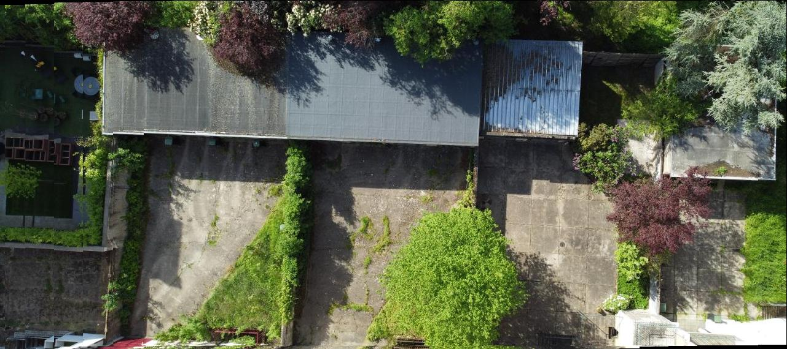
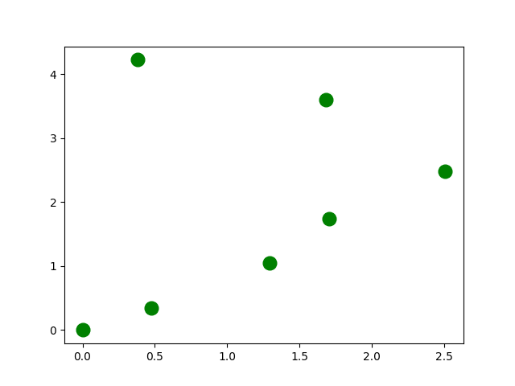
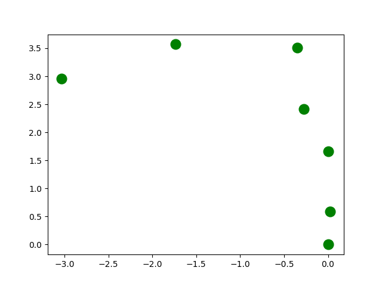
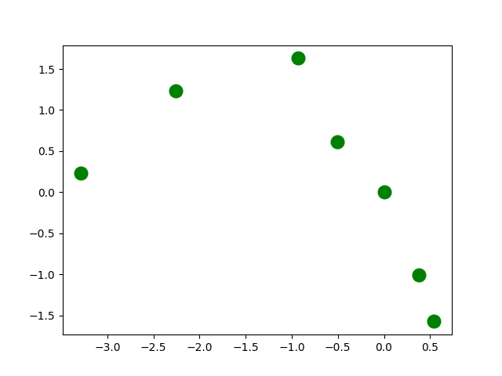
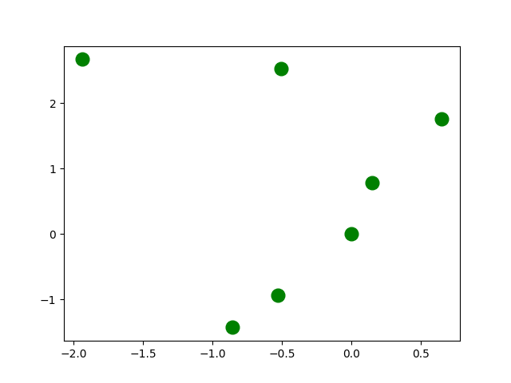

# Mapping DJI Mini2
Projet OpenSource qui permet de rassembler des images prises aux drones DJI Mini 2/3. Il crée 1 seule image finale (permet de cartographier un lieu)
Utilisation gratuite (partage du lien officiel recommandé si possible) 
Participant au Projet : BiMathAx
V1.3

## Rendu
Ici vous avez un exemple de rendu :

*Version 1 avant réglage :*

*Version 1.2 après réglage :*

## Prise de Photo

Une fois l'emplacement choisi, le drône ne doit plus pivoter sur lui même et doit prendre **2 photos alignées** selon l'axe HORIZONTALE ou VERTICALE.

Les 2 photos sont requises pour la calibration de l'*angle*. Une fois effectué, vous pouvez vous ballader sur toutes la zone et dans tous les sens (temps que le drone **ne pivote pas** sur lui-même)

Bien-sûr, vérifier que le signal gps est fort (>12 gps) pour assurer la précision des données GPS des photos.

Les photos doivent toute être prise à la **même altitude** (pour ne pas fausser le *cota pixel/m*). Nous vous conseillons d'utiliser le mode rafale en délai 5s mais des jpeg prises individuellement fonctionnent aussi !

## Baisse de qualité

Ce code assemble des images de hautes qualités. Or Haute qualité est associé à haut temps de traitement ! Pour diminuer le temps de traitement des images pendant la phase d'ajustement, nous vous recommandons de diminuer la qualité de ces dernières...

Le script [reducer_quality.py](../reducer_quality.py) vous permet de baisser la qualité de vos photos : 
- Vous choississez un niveau de compression (minimun 1)
- Le script traite l'image et vous en créer une nouvelle (reduce_<NOM-IMAGE>)

*Conseil: Utiliser des images réduites pour la calibration du logiciel (cota_x, cota_y et angle). Vous pourrez ensuite les remplacez par les images de bonne qualité SANS CHANGEZ LES PARAMATRES*

## Configuration du logiciel

Sur le logiciel ([main2.py](../main2.py)), il y a de nombreuse variable à paramétrer. Nous les détaillons ici :
- **picture_folder** (*string*) : contient le nom du dossier où sont stocké les images à assembler 
- **result_name** (*string*) : nom final de l'image (avec le .jpeg)
- **Blur** (*boolean*) : Active l'effet Blur, ce qui permet de voire à travers les images superposées
- **show_graph** (*boolean*) : Affiche les graphiques de contrôle (util au réglage : voir note *Correction Image*)
- **verbose** (*0 to 3*) : Permet d'afficher ce qu'est entrain de faire le script (le niveau 0 correspond à aucun texte, même pas les erreurs !)
- **setting_file** (*boolean*) : Créer un fichier contenant la valeur des différentes variables (util pour le débuggage)

Les paramètres suivant permettent de pronostiquer la valeur de *cota_x* et *cota_y*. C'est deux variables servent à calculer le nombre de pixel nécessaire pour un espacement de 1m (si cota_x=30px/m et qu'il y a une distance de 3m alors, il y aura 90pixels qui s'éparera les deux images).
Ainsi soit vous renseigner *altitude*, soit *picture_x_meter* *picture_y_meter*, soit *cota_x* *cota_y* (pas les 3 !) :
- **altitude** (*m*): altitude de vol (approximation du cota fiable-)
- **picture_x_meter** (*m*) : nombre de mètre pris sur la largeur de l'image (approximation du cota fiable+)
- **picture_y_meter** (*m*) : nombre de mètre pris sur l'hauteur de l'image (approximation du cota fiable+)
- **cota_x** (*px/m*) : nombre de pixel pour 1 m suivant l'axe X
- **cota_y** (*px/m*) : nombre de pixel pour 1 m suivant l'axe Y

 Enfin il faut spécifier la valeur de l'angle (utilisé pour aligner les photos). Si vous laissez la valeur *None*, il sera *calculé automatiquement* à partir des informations des 2 variables *picture_align_type* et *picture_align*. Ainsi, cette variable sert principalement à la correction de l'angle pronostiqué...
  
*Pour résumer : nous vous conseillons d'exécuter une première fois le script avec la valeur angle = None, de reprendre celui calculé par défaut et de l'ajuster pour corriger les erreurs (voir la section correction)*
- **picture_align_type** (*1 or 2*) : Spécifie si les 2 photos repères sont alignés verticalement ou horizontalement (1 ou 2). *Inutile si la variable angle est différente de 0*
- **picture_align** (*[PICTURE1_NAME, PICTURE2_NAME]*) : Noms des 2 photos servant de repère (voir note *Prise de Photo*). *Obligatoire même si la variable angle est différente de 0*
- **angle** (*int+/- deg*) : Angle en degre qui correspond à la rotation du repère nécessaire pour aligner les photos

## Execution du scipt

Une fois paramétré, vous pouvez exécuter le script par la commande ``python3.exe main2.py``. Celui-ci calcule automatiquement un angle d'alignement et le rapport entre pixel et mètre (*cota*).
Des erreurs peuvent apparaître car le script calcule une valeur approché du rapport entre le nombre de pixel sur l'image et le nombre de mètre. De même, les 2 images utilisé lors de la calibration (et qui sont sensé être alignées) peuvent avoir un décalage de 0.01m...

Ainsi quand vous exécutez le script, notez biens les informations concernant les **cotasXY** et l'**angle**. On les modifiera ensuite pour faire une image de haute qualité !
 
## Correction des images
 
Il est possibles que les images sont proportionnellement au bon endroit MAIS que les proportions soient erronnées. Cette section aborde les modifications à réaliser pour ajuster l'image.

#### Angle

Avant de toucher au proportions, il faut s'assurer que les images soient correctement alignées dans l'espace. Pour ce faire, modifié le script pour afficher les graphiques (``show_graph=True``) et regardé attentivement l'évolution du 2ème au 3ème graphique...
 
*2ème graphique*
 

*3ème graphique ang=50°*
 

 
Que s'est-il passé ?

Le repère à pivoté sur lui-même selon un angle de 50deg afin que le premier point et le troisième point soit aligné sur l'axe des abscisse ! *Je rappelle le point 1 est le premier nom d'image contenu dans la variable picture_align et le deuxième point est la deuxième image de picture_align*
 
 Si maintenant votre drone n'a pas maintenu une ligne droite est s'est ecarté, il faut venir modifier la valeur de l'angle pour que les images soient aux bon endroit !
- **Augmente Angle** : Si on augmente l'angle, alors les images vont être poussé vers la gauche...

*3ème graphique ang=70°*
 

- **Diminue Angle** : Si on diminue l'angle, alors les images vont être poussé vers la droite...

*3ème graphique ang=20°*
 

 
L'angle est donc la première chose à changer pour s'assurer que les images soient toutes aux bonnes endroits (par exemple, qu'elles soient toutes alignées). C'est seuleument une fois que vous l'avez trouvé que vous modifiez les proportions (cota).
 
 

